### linux 开机过程
> BIOS就是在开机的时候，计算机系统会主动执行的第一个程序了;BIOS会依据使用者的设置去取得能够开机的硬盘，并且到该硬盘里面去读取第一个扇区的MBR位置。 MBR这个仅有446 Bytes的硬盘容量里面会放置最基本的开机管理程序，**这个开机管理程序的目的是在载入（load）核心文件**

> 1.  BIOS：开机主动执行的固件，会认识第一个可开机的设备；
> 2. MBR：第一个可开机设备的第一个扇区内的主要开机记录区块，内含开机管理程序；
> 3. 开机管理程序（boot loader）：一支可读取核心文件来执行的软件；
> 4. 核心文件：开始操作系统的功能...

> BIOS是一个写入到主板上的一个固件(固件就是写入到硬件上的一个软件程序)

### 文件系统与目录树的关系（挂载）
------
#### 什么是挂载？
> 利用一个目录成为**进入点**，将其磁盘分区放置在该目录下；即将该目录变为分区的入口，这个动作成为挂载，该目录成为挂载点。

**技巧**:
> 当我想要知道/home/vbird/test这个文件在哪个partition时?
> 由test --> vbird --> home --> /，看哪个“进入点”先被查到那就是使用的进入点了。 所以test使用的是/home这个进入点而不是/喔！

**例题：**
> 现在让我们来想一想，我的计算机系统如何读取光盘内的数据呢？
> 在Windows里面使用的是“光驱”的代号方式处理（假设为E盘时）， 但在Linux下面我们依旧使用目录树喔！
> 在默认的情况下，Linux是将光驱的数据放置到/media/cdrom里头去的。 如果光盘片里面有个文件文件名为“我的文件”时，那么这个文件是在哪里？

**答案:**
> Linux: /media/cdrom/我的文件夹

> 如果光驱并非被挂载到/media/cdrom，而是挂载到/mnt这个目录时，刚刚读取的这个文件的文件名会变成：
> Linux: /mnt/我的文件夹
------
### 自订安装“Custom”
> A：初次接触Linux：只要分区“ / ”及“swap”即可
> B：建议分区的方法：预留一个备用的剩余磁盘容量！

#### 2.3安装Linux前的规划

加入强制使用 GPT 分区表的安装参数
> 如前所述，如果磁盘容量小于 2TB 的话，系统默认会使用 MBR 模式来安装！鸟哥的虚拟机仅有 40GB 的磁盘容量，所以
默认肯定会用 MBR 模式来安装的啊！那如果想要强制使用 GPT 分区表的话，你就得要这样作：

> 1. 使用方向键，将下图的光标**移动到“ Install CentOS 7 ”的项目中**
> 2. **按下键盘的 [Tab] 按钮**，让光标跑到画面最下方等待输入额外的核心参数
> 3. 在出现的画面中，输入如下画面的数据 （注意，各个项目要有空格，最后一个是光标本身而非底线）
> 
其实重点就是输入“ **inst.gpt** ”这个关键字！
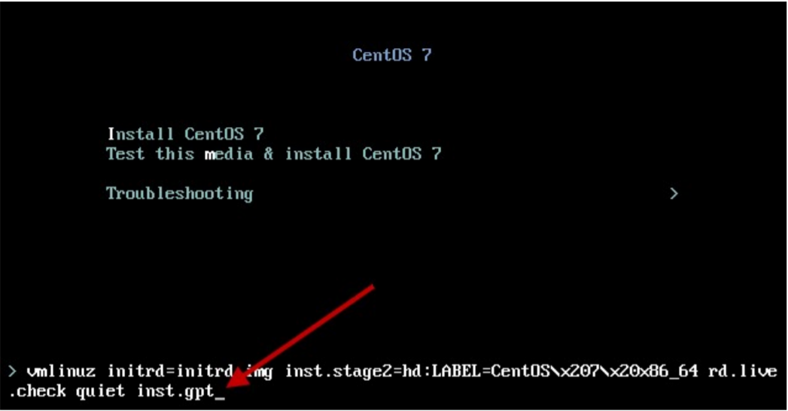

软件选择
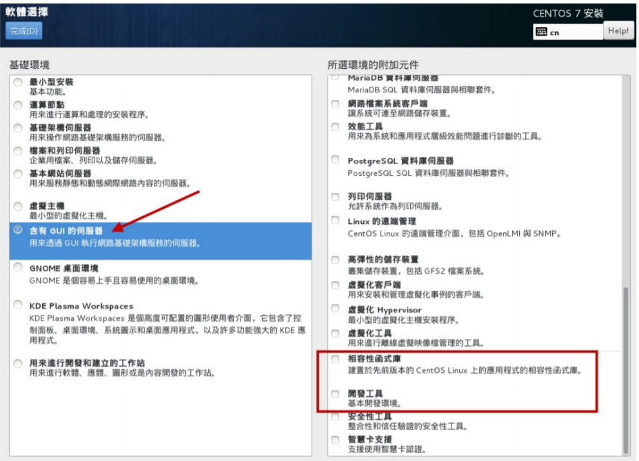

###### 磁盘分区与文件系统设置
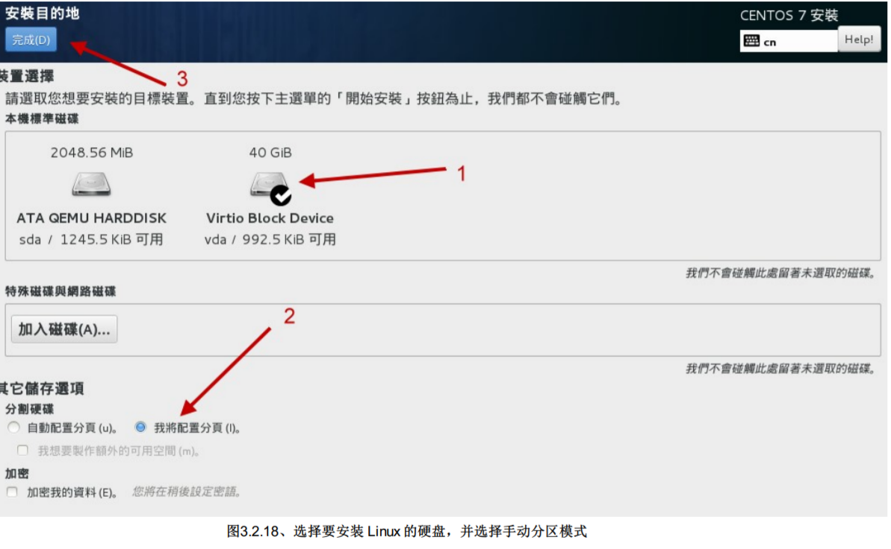

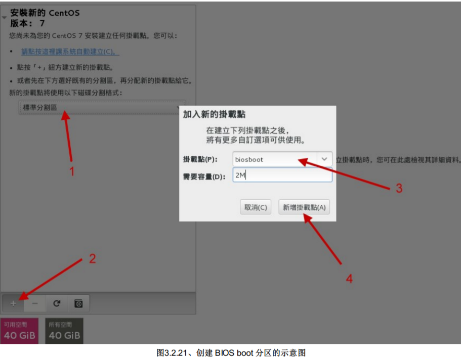
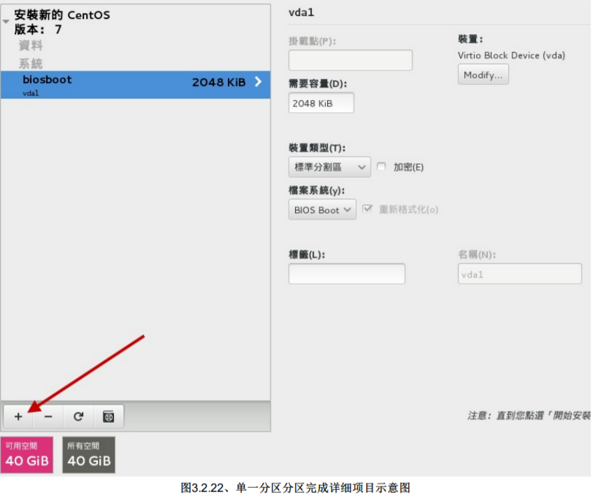
> 由于是 bios 使用，因此没有挂载点 （你看画面中该字段是空空
如也的！）。 同时文件系统的字段部份也是会变成“BIOS Boot”的关键字！并不会是 Linux 的文件系统啦！

> BIOS Boot：就是 GPT 分区表可能会使用到的项目，若你使用 MBR 分区，那就不需要这个项目了！

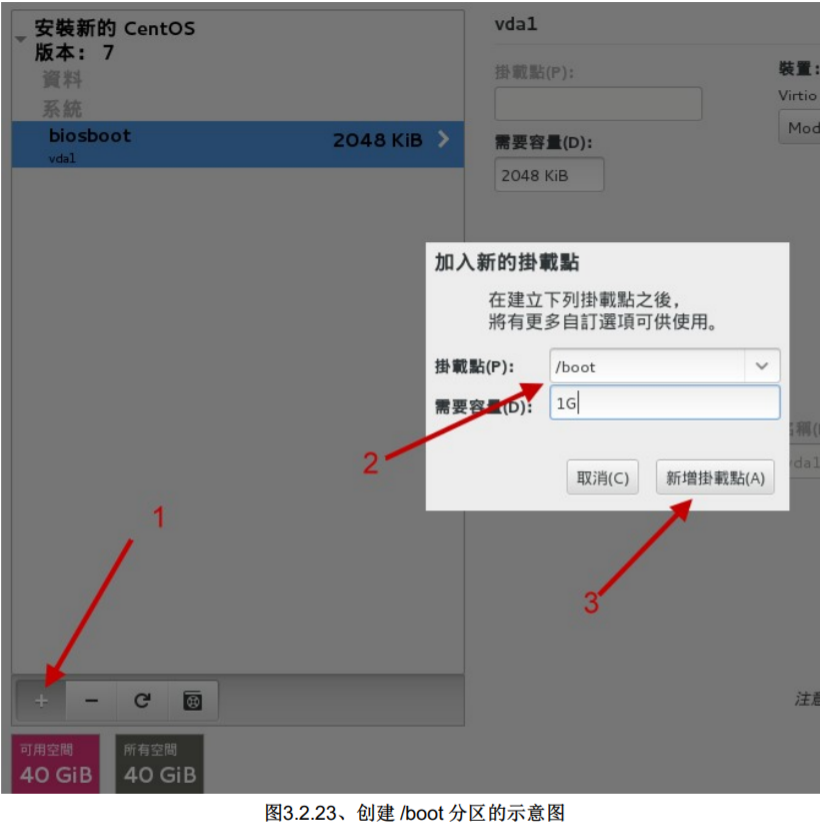
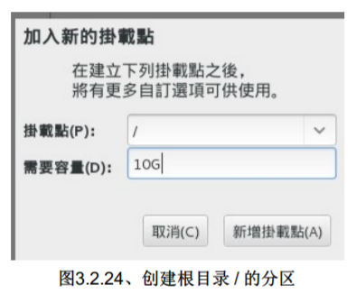
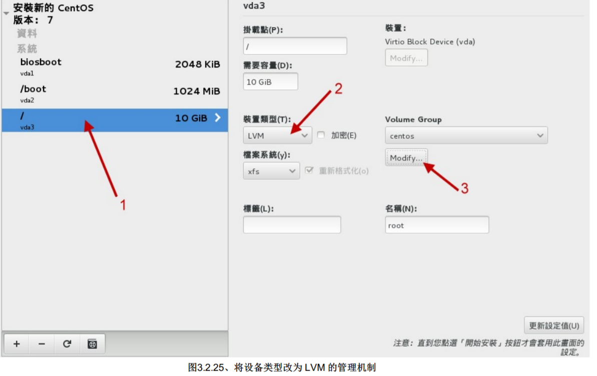
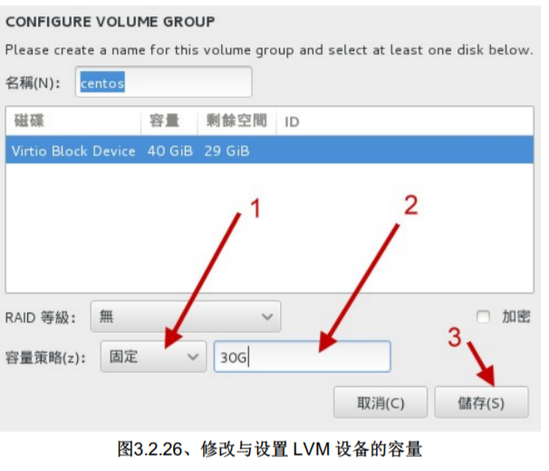
> 填入“ 30G ”左右的容量，这样我们就还有剩下将近 10G 的容量可以继续未来的章节内容练习

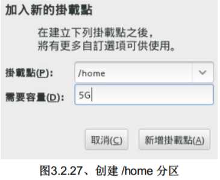
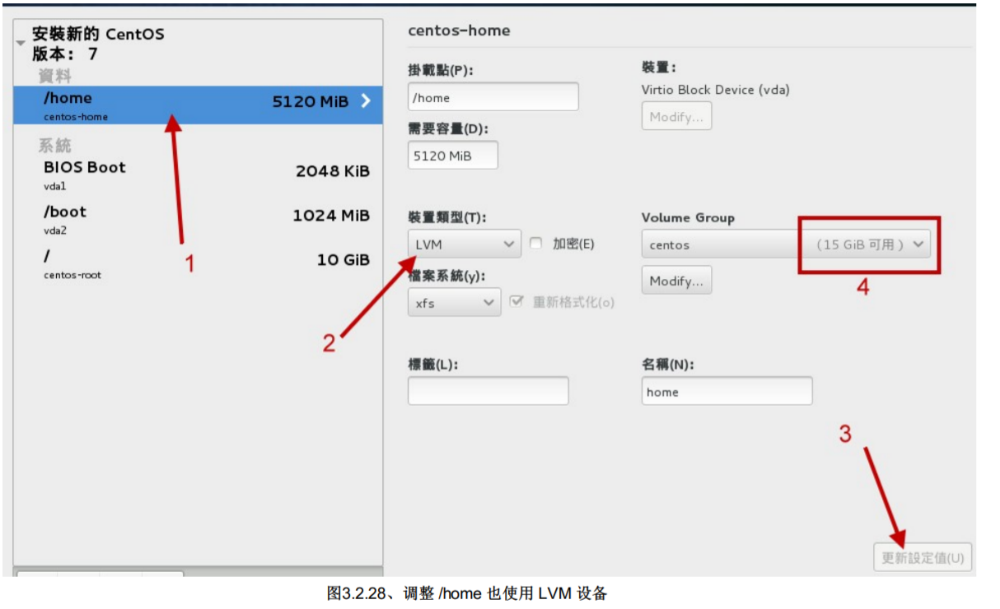
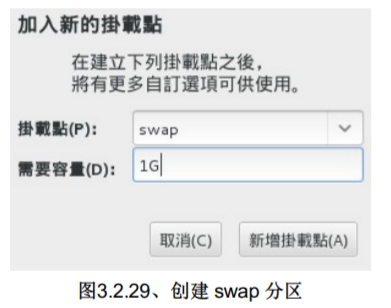
> swap 是当实体内存容量不够用时，可以拿这个部份来存放内存中较少被使用的程序项目。

#### Tips:
> swap内存交换空间的功能是：
> 当有数据被存放在实体内存里面，但是这些数据又不是常被CPU所取用时， 那么这些不常被使用的程序将会被
丢到硬盘的swap交换空间当中， 而将速度较快的实体内存空间释放出来给真正需要的程序使用！ 所以，如果你的系统不很忙，而内存又很
大，自然不需要swap啰。

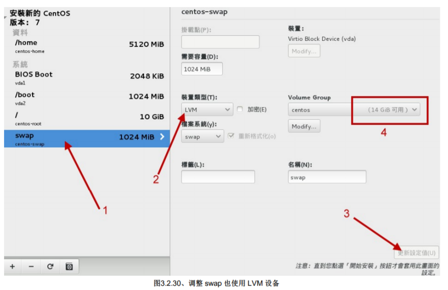

> 提醒你是否要真的进行这样的分区与格式化

> 可以发现方框圈起来的地方，删除了 MSDOS 而创建了 GPT 

##### 核心管理与网络设置
> （慎用）点选“系统”下的“KDUMP”项目，这个项目主要在处理，当 Linux 系统因为核心问题导致的死机事
件时， 会将该死机事件的内存内数据储存出来的一项特色！

> 这边使用的是虚拟机，因此看到的网卡就会是旧式的 eth0 之类的网卡代号。如果是实体网卡，那你可能会看到类似 p1p1, em1 等等比较特殊的网卡代号！

如果一切顺利的话，那么你应该就可以看到如下的图示，所有的一切都是正常的状态！因此你就可以按下下面图示的箭头部份， 开始安装的流程啰！

> 刚刚上面所选择的项目，包括 root 的密码等等，通通都会被纪录到 /root/anaconda-ks.cfg 这个文件内

##### 注意：

 - 尽量使用一般用户来操作Linux，有必要再转身份成为root即可。
 - 即使是练习机，在创建 root 密码时，建议依旧能够保持良好的密码规则，不要随便设置！
 - CentOS 7默认使用 xfs 作为文件系统
 - 设置时不要选择启动kdump，因为那是给核心开发者查阅死机数据的；